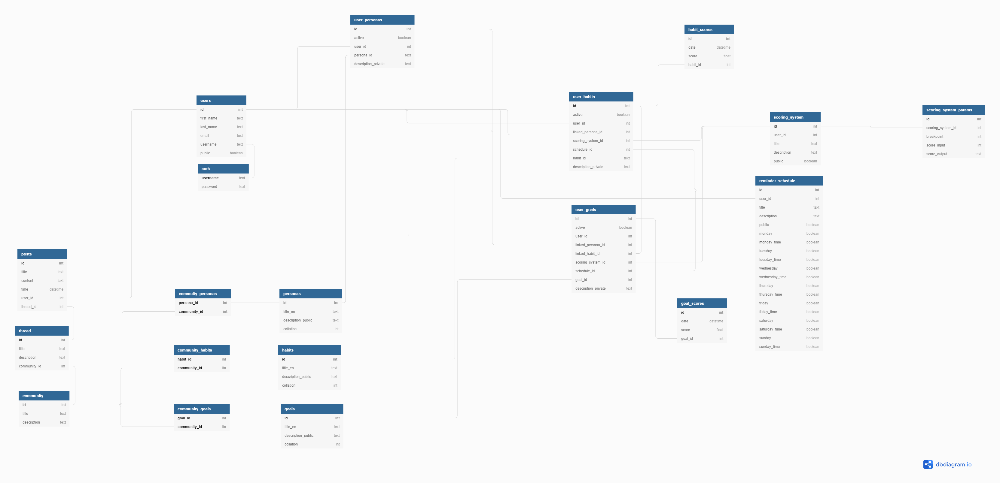

# Better Everyday is currently deployed at the following link:
https://be-better-everyday.herokuapp.com/ 

## Website Goal
The Better Everyday website is aimed at providing a database backed habit & goal tracking system which flows into a persona/character you are looking to develop.  Say for example you want to become an olympic athelete (persona).  An olympic athelete has established a rigorous set of habits to maximize their physical performance in their sport and is consistently setting goals for themself to reach the next level.  The BE website provides a centralized location for cataloging those activities & tracking progress against them. 

Setup your personas, habits, and goals on the BE website and track your journey towards mastery utilizing the daily time tracking capabilities and personalizable scoring systems which make the time spent more meaningful to you.  

## Features List
   - User Registration & Login Capabilities
      - Provides users individual accounts to keep their tracking private and access it anywhere
   - User Persona Creation, Data Collation, & Graphing
      - This provides the link between different goals/habits into an overarching goal, which in this context is reffered to as a persona.
      - Visualization of these scores in a graphical format makes the data more digestable and meaningful.
   - Scoring System Creation & Graphing
      - This can be used to make time inputs for meaningful.  I.e. Achieving 100% of a target may by different per goal/habit and the time spent therein.
      - Visualization of these scores in a graphical format makes the data more digestable and meaningful.
   - User Habit Creation, Score Tracking, Linkage to Personas, Selection of Scoring System, and Graphing
      - A user habit is distinct from a user goal in its meaning to the user.  A habit is a continuous activity whereas a goal is generally finite.
      - Score tracking, core capability of the platform which is used for tracking progress
      - Visualization of these scores in a graphical format makes the data more digestable and meaningful.
   - User Goal Creation, Score Tracking, Linkage to Personas, Selection of Scoring System, and Graphing
      - A user goal is distinct from a user habit in its meaning to the user.  A habit is a continuous activity whereas a goal is generally finite.
      - Score tracking, core capability of the platform which is used for tracking progress
      - Visualization of these scores in a graphical format makes the data more digestable and meaningful.

# Setup requirements
In order to get the environment running an environment file simply named .env will need to be created with the appropriate variables.  An example file for this purpose has been included under the name of ".env.example."  The three variables listed below must be updated for complete project functionalities.
```
SQLALCHEMY_DATABASE_URI_PROD = "ProductionDatabasePath"

SQLALCHEMY_DATABASE_URI_TEST = "TestDatabasePath"

PEXELS_API_KEY = 'APIKeyFromPEXELS'
```

# The Database Schema currently consists of 19 tables.

## User Tables:
- Auth - Table for user authentication
- Users - Table holding Usernames and Personally Identifiable Information

## Habit Tables:
- Persona - List of User Personas
- Habit - List of User Habits
- Goals - List of User Goals
- User_Persona - Relationship table linking users to their target personas
- User_Habit - Relationship table linking users to their target habits, overarching personas, goal scoring system, and goal reminder schedule
- User_Goal - Relationship table linking users to their target goals, overarching personas, goal scoring system, and goal reminder schedule

## Tracking Tables:
- Goal_Score - List of scores and associated dates for user goals
- Habit_Score - List of scores and associated dates for user habits
- Scoring_System - Definition of scoring system used for the target goal
- Scoring_System_Params - Details on breakpoints and their meaning for the target goal
- Reminder_Schedule - Lookup for driving user reminders based on day of week & time

## Community Forum Tables (Not implemented in MVP):
- Community - Master record for an entire community
- Thread - Each community can have multiple threads
- Post - Each thread consists of multiple posts
- Community_Personas - Relationship table for linking multiple target personas to their relevant communities
- Community_Habits - Relationship table for linking multiple target habits to their relevant communities
- Community_Goals - Relationship table for linking multiple target goals to their relevant communities

### The reference picture attached below includes 4 tables for messaging functionality which will not be included in v1 of the project.



# API(s) Utilized

1. This project utilized the Google Charts API for generating data visualizations based on the data queried from the SQL backend. Additional information on this API can be found at the link below:
    - https://developers.google.com/chart
    - No API key required

2. Landing page art is provided by the Pexels API in the MVP.  Future revisions may include customizable user profiles with images provided by PEXELs:
   - https://www.pexels.com/api/documentation/ 
   - An API key must be provided in the .env file for authentication purposes.


# Technology Stack
   - Python
      - Flask
      - SQLAlchemy
      - WTForms
      - Bcrypt
   - HTML
      - Jinja2
   - Bootstrap
   - JavaScript
      - Axios
      - jQuery
   - PostGreSQL
   
